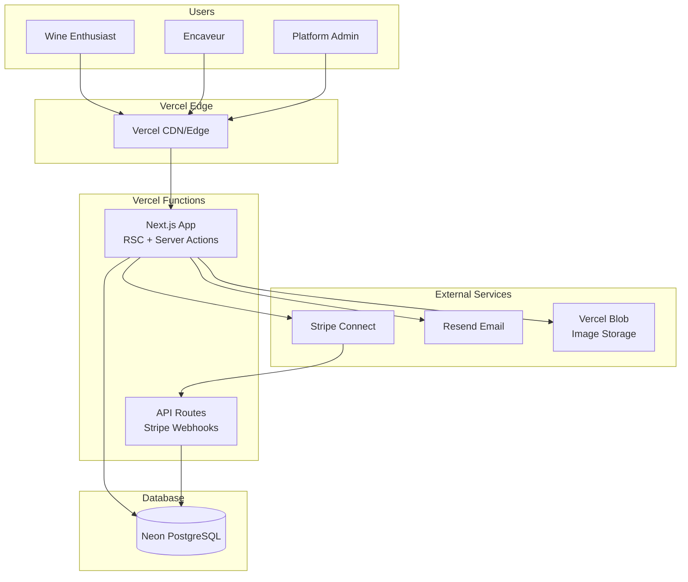
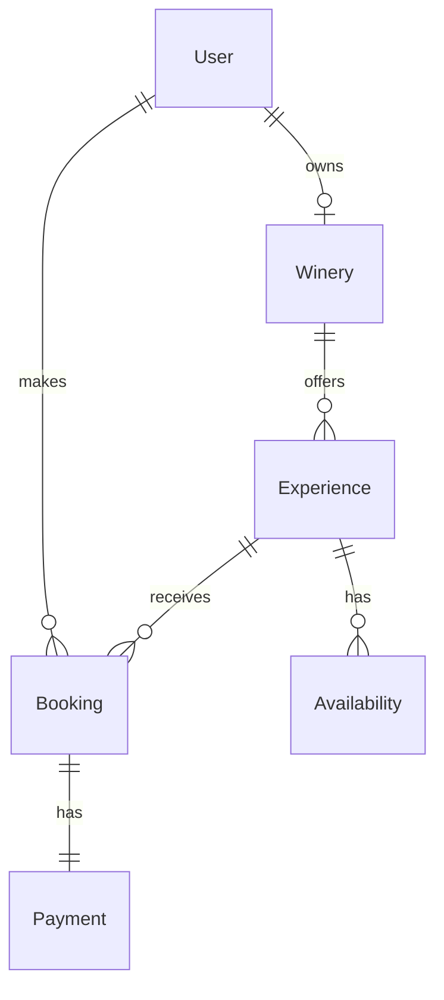
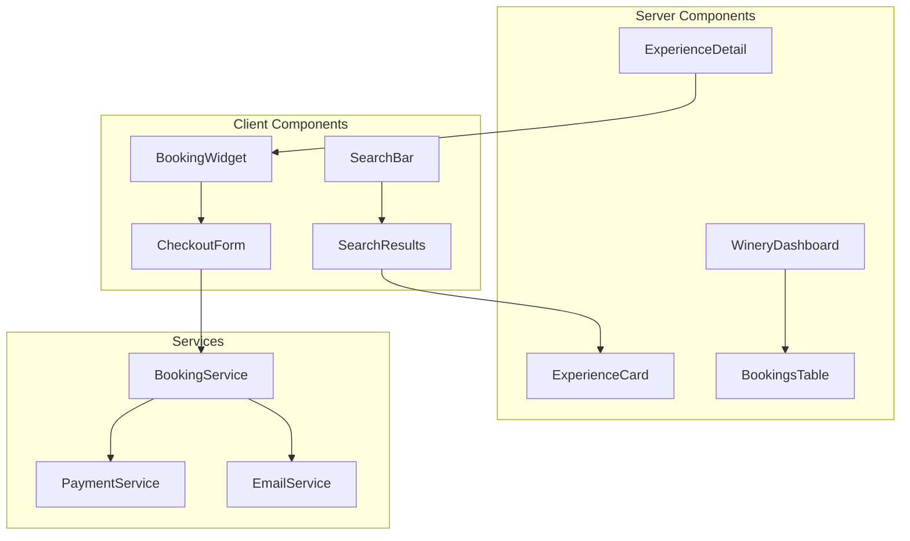
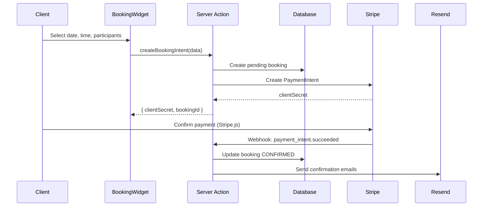
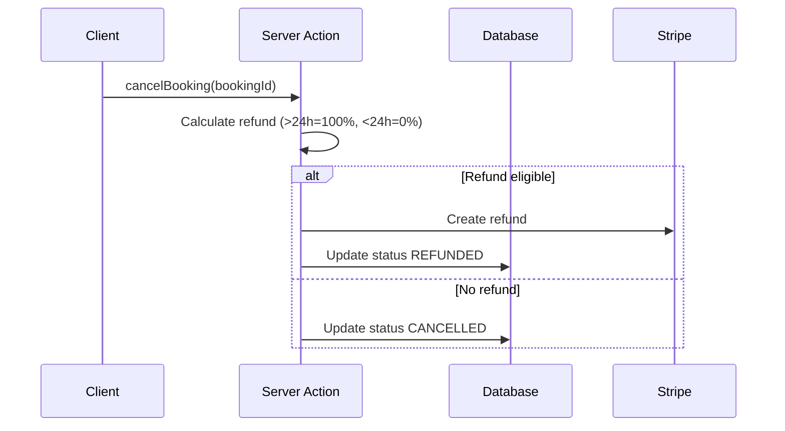
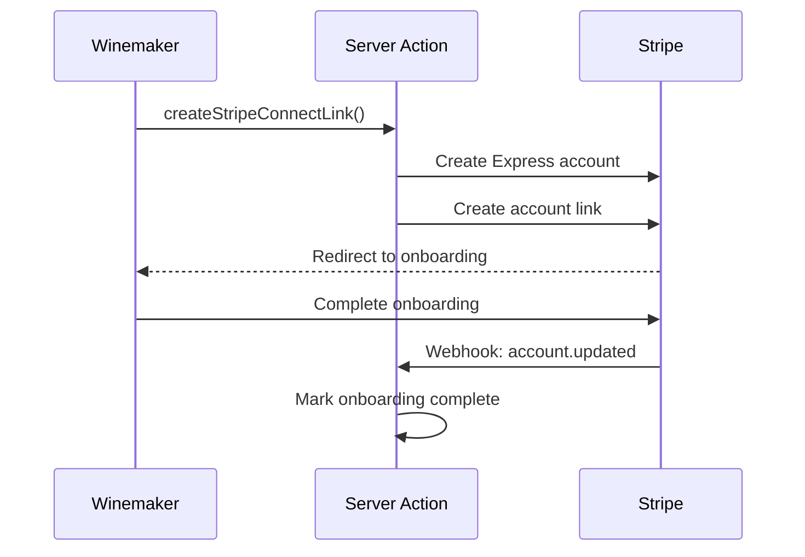
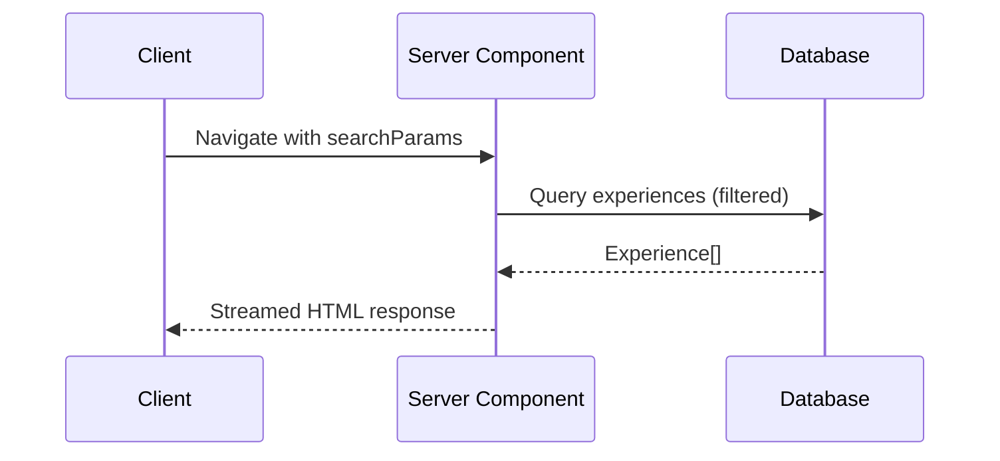

# EnCave Fullstack Architecture Document

## Introduction

This document outlines the complete fullstack architecture for **EnCave**, including backend systems, frontend implementation, and their integration. It serves as the single source of truth for AI-driven development, ensuring consistency across the entire technology stack.

This unified approach combines what would traditionally be separate backend and frontend architecture documents, streamlining the development process for a modern Next.js full-stack application where frontend and backend concerns are tightly integrated through React Server Components and Server Actions.

### Starter Template or Existing Project

**N/A - Greenfield project**

Starting with `create-next-app` (TypeScript, Tailwind, ESLint, App Router enabled) and adding dependencies incrementally. This aligns with the PRD's Server Actions approach and avoids unnecessary complexity from opinionated starters.

### Change Log

| Date       | Version | Description                   | Author              |
| ---------- | ------- | ----------------------------- | ------------------- |
| 2026-01-07 | 1.0     | Initial architecture document | Winston (Architect) |

---

## High Level Architecture

### Technical Summary

EnCave is a **Next.js 14+ full-stack monolith** deployed on **Vercel** with **Neon PostgreSQL** as the database layer. The architecture leverages React Server Components (RSC) for optimal performance and SEO, Server Actions for type-safe mutations, and API Routes exclusively for webhook handling (Stripe). The frontend and backend share TypeScript types end-to-end via Prisma-generated types. External integrations include **Stripe Connect** for marketplace payments, **Resend** for transactional emails, and **Vercel Blob** for image storage. This architecture achieves the PRD's goals of rapid development, excellent SEO for wine tourism discovery, and low operational overhead for a small team.

### Platform and Infrastructure Choice

**Platform:** Vercel
**Key Services:** Vercel Functions, Vercel Blob, Neon PostgreSQL, Vercel Analytics
**Deployment Regions:** Frankfurt (fra1) - closest to Switzerland

**Decision Rationale:**

- PRD explicitly specifies Vercel hosting and Neon/Supabase for DB
- Neon's database branching enables safe migrations and preview environments
- No unnecessary features (Supabase auth conflicts with NextAuth.js preference)
- Cost-effective: both have generous free tiers suitable for MVP validation

### Repository Structure

**Structure:** Single-app monorepo (not multi-package)
**Monorepo Tool:** N/A - single Next.js app, npm workspaces not needed
**Package Organization:** Flat structure within `src/`

```
encave/
├── src/
│   ├── app/           # Next.js App Router (pages + API routes)
│   ├── components/    # React components (ui/, features/, layout/)
│   ├── lib/           # Business logic, utilities, constants
│   ├── server/        # Server-only code (DB queries, services)
│   └── types/         # Shared TypeScript types
├── prisma/            # Database schema & migrations
├── public/            # Static assets
├── docs/              # Project documentation
└── tests/             # Test files mirroring src/ structure
```

### High Level Architecture Diagram



### Architectural Patterns

- **Full-Stack Monolith:** Single Next.js application handling both frontend and backend - _Rationale:_ Simplest deployment model, shared types, no API versioning overhead for MVP
- **React Server Components (RSC):** Server-side rendering with streaming - _Rationale:_ Optimal Core Web Vitals, SEO for discovery pages, reduced client JS bundle
- **Server Actions for Mutations:** Type-safe RPC-style mutations without REST boilerplate - _Rationale:_ PRD specifies this pattern; simpler than tRPC, built into Next.js
- **Repository Pattern:** Abstract database access via Prisma in `src/server/` - _Rationale:_ Testability, single source for data access logic
- **Feature-Based Component Organization:** Group components by feature (booking/, winery/, experience/) - _Rationale:_ Scalable organization as features grow
- **Optimistic UI Updates:** Immediate UI feedback with Server Action revalidation - _Rationale:_ Responsive feel for booking interactions

---

## Tech Stack

This is the **DEFINITIVE** technology selection for EnCave. All development must use these exact technologies and versions.

| Category             | Technology            | Version               | Purpose                    | Rationale                                            |
| -------------------- | --------------------- | --------------------- | -------------------------- | ---------------------------------------------------- |
| Frontend Language    | TypeScript            | 5.3+                  | Type-safe development      | PRD requirement; end-to-end type safety              |
| Frontend Framework   | Next.js               | 14.2+                 | Full-stack React framework | PRD specifies; App Router, RSC, Server Actions       |
| UI Component Library | shadcn/ui             | latest                | Accessible UI primitives   | PRD specifies; no vendor lock-in, customizable       |
| State Management     | React Context + nuqs  | Context 18+, nuqs 1.x | Local + URL state          | PRD specifies; no Redux overhead                     |
| Backend Language     | TypeScript            | 5.3+                  | Server-side logic          | Same as frontend; shared types                       |
| Backend Framework    | Next.js API Routes    | 14.2+                 | Webhook endpoints          | Integrated with Next.js; minimal for webhooks only   |
| API Style            | Server Actions        | Next.js 14+           | Type-safe mutations        | PRD specifies; built-in, no REST boilerplate         |
| Database             | PostgreSQL            | 16                    | Primary data store         | PRD specifies; robust, excellent Prisma support      |
| ORM                  | Prisma                | 5.x                   | Type-safe database access  | PRD specifies; migrations, excellent DX              |
| Cache                | Vercel Data Cache     | -                     | RSC caching                | Built into Next.js; no external Redis needed for MVP |
| File Storage         | Vercel Blob           | -                     | Image uploads              | PRD specifies; CDN integrated, simple API            |
| Authentication       | NextAuth.js (Auth.js) | 5.x                   | User authentication        | PRD specifies; Email/password + Google OAuth         |
| Frontend Testing     | Vitest + RTL          | Vitest 1.x, RTL 14+   | Unit/component tests       | PRD specifies; fast, React Testing Library           |
| Backend Testing      | Vitest                | 1.x                   | Integration tests          | Consistent with frontend; test database              |
| E2E Testing          | Playwright            | 1.40+                 | End-to-end tests           | PRD specifies (Phase 2); cross-browser               |
| Build Tool           | Next.js CLI           | 14.2+                 | Build & dev server         | Built into Next.js                                   |
| Bundler              | Turbopack             | Next.js built-in      | Dev bundling               | Faster dev experience; Webpack for prod              |
| IaC Tool             | Vercel CLI + Git      | -                     | Infrastructure deployment  | Git-based deploys; no Terraform needed               |
| CI/CD                | GitHub Actions        | -                     | Automated pipelines        | PRD specifies; Vercel auto-deploy                    |
| Monitoring           | Vercel Analytics      | -                     | Performance monitoring     | Built-in; Core Web Vitals                            |
| Error Tracking       | Sentry                | 7.x                   | Error monitoring           | PRD specifies; excellent Next.js integration         |
| Logging              | Vercel Logs           | -                     | Application logs           | Built-in; sufficient for MVP                         |
| CSS Framework        | Tailwind CSS          | 3.4+                  | Utility-first styling      | PRD specifies; rapid development                     |
| Form Handling        | React Hook Form       | 7.x                   | Form state management      | PRD specifies; performant                            |
| Validation           | Zod                   | 3.x                   | Schema validation          | PRD specifies; shared client/server                  |
| Email                | Resend                | -                     | Transactional emails       | PRD specifies; React Email support                   |
| Payments             | Stripe Connect        | -                     | Marketplace payments       | PRD specifies; Express accounts                      |
| i18n                 | next-intl             | 3.x                   | French/German support      | PRD specifies; App Router compatible                 |

### Key Decisions

1. **NextAuth.js v5 (Auth.js):** Better App Router support and Edge compatibility
2. **nuqs for URL State:** Type-safe URL search params for shareable search URLs
3. **No Redis Cache:** Vercel's built-in Data Cache sufficient for MVP
4. **Sentry over Vercel Error Tracking:** More detailed error context and source maps
5. **Turbopack for Dev Only:** Production builds use Webpack (more stable)

---

## Data Models

### User

**Purpose:** Represents all platform users - wine enthusiasts, winemakers, and admins.

```typescript
interface User {
  id: string;
  email: string;
  name: string | null;
  role: 'USER' | 'WINEMAKER' | 'ADMIN';
  emailVerified: Date | null;
  image: string | null;
  locale: 'fr' | 'de';
  createdAt: Date;
  updatedAt: Date;
}
```

**Relationships:** Has one Winery (if WINEMAKER), has many Bookings (as client)

### Winery

**Purpose:** Winemaker business profile with verification status and Stripe Connect account.

```typescript
interface Winery {
  id: string;
  userId: string;
  name: string;
  slug: string;
  description: Record<'fr' | 'de', string>;
  region: string;
  address: string;
  coordinates: { lat: number; lng: number } | null;
  phone: string;
  website: string | null;
  status: 'PENDING' | 'VERIFIED' | 'SUSPENDED';
  stripeAccountId: string | null;
  stripeOnboardingComplete: boolean;
  images: string[];
  createdAt: Date;
  updatedAt: Date;
}
```

**Relationships:** Belongs to User, has many Experiences

### Experience

**Purpose:** Wine experience offered by a winery (tasting, cellar visit, workshop).

```typescript
interface Experience {
  id: string;
  wineryId: string;
  type: 'TASTING' | 'CELLAR_VISIT' | 'WORKSHOP';
  title: Record<'fr' | 'de', string>;
  description: Record<'fr' | 'de', string>;
  duration: number; // minutes
  price: number; // cents CHF
  minCapacity: number;
  maxCapacity: number;
  cancellationPolicy: string;
  images: string[];
  winesOffered: string[];
  isActive: boolean;
  createdAt: Date;
  updatedAt: Date;
}
```

**Relationships:** Belongs to Winery, has many Availabilities, has many Bookings

### Availability

**Purpose:** Time slots when an experience can be booked.

```typescript
interface Availability {
  id: string;
  experienceId: string;
  dayOfWeek: number | null; // 0=Sunday, 6=Saturday (null for one-time)
  startTime: string; // "10:00"
  endTime: string; // "12:00"
  specificDate: Date | null;
  isBlocked: boolean;
  createdAt: Date;
  updatedAt: Date;
}
```

### Booking

**Purpose:** Reservation made by a client for an experience.

```typescript
interface Booking {
  id: string;
  reference: string; // "ENC-2026-001234"
  userId: string;
  experienceId: string;
  wineryId: string; // denormalized
  date: Date;
  startTime: string;
  participants: number;
  totalAmount: number; // cents
  platformFee: number; // cents (12%)
  status: 'PENDING' | 'CONFIRMED' | 'COMPLETED' | 'CANCELLED' | 'REFUNDED';
  cancellationReason: string | null;
  clientNotes: string | null;
  stripePaymentIntentId: string | null;
  createdAt: Date;
  updatedAt: Date;
}
```

### Payment

**Purpose:** Stripe payment record linked to a booking.

```typescript
interface Payment {
  id: string;
  bookingId: string;
  stripePaymentIntentId: string;
  stripeTransferId: string | null;
  amount: number;
  platformFee: number;
  wineryPayout: number;
  status: 'PENDING' | 'SUCCEEDED' | 'FAILED' | 'REFUNDED';
  paidAt: Date | null;
  refundedAt: Date | null;
  createdAt: Date;
  updatedAt: Date;
}
```

### Entity Relationship Diagram



---

## API Specification

The PRD specifies **Server Actions** for mutations rather than a traditional REST API. API Routes are used **only** for external webhooks (Stripe).

### Server Actions (Primary API)

Server Actions provide type-safe, RPC-style mutations directly callable from React components.

**Organization:**

```
src/server/actions/
├── auth.ts           # Authentication actions
├── winery.ts         # Winery management
├── experience.ts     # Experience CRUD
├── booking.ts        # Booking operations
├── availability.ts   # Schedule management
└── admin.ts          # Admin operations
```

**Key Actions:**

| Module       | Action                       | Purpose                      | PRD Ref  |
| ------------ | ---------------------------- | ---------------------------- | -------- |
| auth         | `registerWinemaker()`        | Register new winemaker       | FR8      |
| winery       | `updateWinery()`             | Update winery profile        | FR9      |
| winery       | `createStripeConnectLink()`  | Initiate Stripe onboarding   | FR13     |
| experience   | `createExperience()`         | Create new experience        | FR9      |
| experience   | `updateExperience()`         | Update experience details    | FR9      |
| availability | `setRecurringAvailability()` | Set weekly schedule          | FR12     |
| availability | `blockDateRange()`           | Block dates                  | FR12     |
| booking      | `createBookingIntent()`      | Create Stripe payment intent | FR4, FR5 |
| booking      | `cancelBooking()`            | Cancel with refund logic     | FR7      |
| admin        | `verifyWinery()`             | Approve winemaker            | FR15     |

**Action Result Type:**

```typescript
type ActionResult<T> =
  | { success: true; data: T }
  | { success: false; error: { code: string; message: string } };
```

### API Routes (Webhooks Only)

```
src/app/api/webhooks/stripe/route.ts
```

**Stripe Events Handled:**

- `payment_intent.succeeded` → Confirm booking, send email
- `payment_intent.payment_failed` → Mark failed, notify user
- `account.updated` → Update winery Stripe status
- `charge.refunded` → Update booking/payment status

### Data Fetching

Read operations use **direct database queries in Server Components** (no API endpoints):

- Eliminates API round-trips
- Enables streaming with Suspense
- Automatic caching via Next.js Data Cache

---

## Components

### Component Organization

```
src/components/
├── ui/                    # shadcn/ui primitives
├── layout/                # App shell, navigation, footer
├── features/              # Feature-specific components
│   ├── auth/              # Login, register, profile
│   ├── winery/            # Winery cards, profile, dashboard
│   ├── experience/        # Experience cards, forms, detail
│   ├── booking/           # Booking flow, calendar, checkout
│   ├── search/            # Search bar, filters, results
│   └── admin/             # Admin dashboard components
└── shared/                # Reusable cross-feature components
```

### Key Feature Components

| Module     | Component             | Type   | Responsibility                    |
| ---------- | --------------------- | ------ | --------------------------------- |
| search     | `SearchBar`           | Client | Location/date/type with URL state |
| search     | `SearchResults`       | Server | Experience list with pagination   |
| search     | `ExperienceCard`      | Server | Experience preview card           |
| experience | `ExperienceDetail`    | Server | Full experience page              |
| experience | `ExperienceForm`      | Client | Create/edit experience            |
| booking    | `BookingWidget`       | Client | Date/time/participants selector   |
| booking    | `CheckoutForm`        | Client | Stripe Elements payment           |
| booking    | `BookingConfirmation` | Server | Confirmation with details         |
| winery     | `WineryDashboard`     | Server | Winemaker management hub          |
| winery     | `BookingsTable`       | Client | Upcoming/past bookings            |
| winery     | `CalendarView`        | Client | Full calendar with bookings       |
| winery     | `StripeOnboarding`    | Client | Stripe Connect setup              |
| admin      | `PendingWineries`     | Server | Verification queue                |

### Server Services

```
src/server/services/
├── booking.service.ts     # Availability, conflicts, refunds
├── payment.service.ts     # Stripe integration
├── email.service.ts       # Resend transactional emails
└── availability.service.ts # Schedule calculations
```

### Component Diagram



---

## External APIs

### Stripe Connect API

- **Purpose:** Marketplace payment processing with split payments to winemakers
- **Documentation:** https://stripe.com/docs/connect
- **Authentication:** Bearer token via `STRIPE_SECRET_KEY`
- **Rate Limits:** 100 req/sec (25 for Connect)

**Key Endpoints:**
| Method | Endpoint | Purpose |
|--------|----------|---------|
| `POST` | `/v1/accounts` | Create Express account for winemaker |
| `POST` | `/v1/account_links` | Generate onboarding link |
| `POST` | `/v1/payment_intents` | Create payment with transfer |
| `POST` | `/v1/refunds` | Process booking refunds |

**Integration Notes:**

- Account type: Express (Stripe handles KYC)
- Payment flow: Direct charges with `application_fee_amount` (12%)
- Webhook endpoint: `/api/webhooks/stripe`

### Resend API

- **Purpose:** Transactional email delivery
- **Documentation:** https://resend.com/docs
- **Authentication:** Bearer token via `RESEND_API_KEY`

**Email Templates:**
| Template | Trigger | Recipient |
|----------|---------|-----------|
| `BookingConfirmation` | Payment success | Client |
| `BookingCancellation` | Cancellation | Client |
| `NewBookingNotification` | New booking | Winemaker |
| `WinemakerWelcome` | Approved | Winemaker |

### Vercel Blob API

- **Purpose:** Image storage for wineries and experiences
- **Documentation:** https://vercel.com/docs/storage/vercel-blob
- **Integration:** `@vercel/blob` SDK
- **Limits:** 4.5MB max file size, JPEG/PNG/WebP

### Google OAuth

- **Purpose:** Social login
- **Integration:** NextAuth.js Google provider
- **Scopes:** `openid`, `email`, `profile`

### Environment Variables

```bash
# Stripe
STRIPE_SECRET_KEY=sk_...
STRIPE_PUBLISHABLE_KEY=pk_...
STRIPE_WEBHOOK_SECRET=whsec_...
# Resend
RESEND_API_KEY=re_...
# Vercel Blob
BLOB_READ_WRITE_TOKEN=vercel_blob_...
# Google OAuth
GOOGLE_CLIENT_ID=...
GOOGLE_CLIENT_SECRET=...
# Database
DATABASE_URL=postgresql://...
# NextAuth
NEXTAUTH_SECRET=...
NEXTAUTH_URL=https://encave.ch
```

---

## Core Workflows

### 1. Client Booking Flow



### 2. Booking Cancellation Flow



### 3. Winemaker Stripe Onboarding



### 4. Experience Search (RSC)



---

## Database Schema

### Prisma Schema (Summary)

```prisma
// Enums
enum UserRole { USER, WINEMAKER, ADMIN }
enum Locale { fr, de }
enum WineryStatus { PENDING, VERIFIED, SUSPENDED }
enum ExperienceType { TASTING, CELLAR_VISIT, WORKSHOP }
enum BookingStatus { PENDING, CONFIRMED, COMPLETED, CANCELLED, REFUNDED }
enum PaymentStatus { PENDING, SUCCEEDED, FAILED, REFUNDED }

// Core Models
model User {
  id, email, name, role, locale, password?, emailVerified?
  -> accounts[], sessions[], winery?, bookings[]
}

model Winery {
  id, userId, name, slug, description(JSON), region, address,
  coordinates?, phone, website?, status, stripeAccountId?,
  stripeOnboardingComplete, images[]
  -> user, experiences[], bookings[]
}

model Experience {
  id, wineryId, type, title(JSON), description(JSON), duration,
  price, minCapacity, maxCapacity, cancellationPolicy, images[],
  winesOffered[], isActive
  -> winery, availabilities[], bookings[]
}

model Availability {
  id, experienceId, dayOfWeek?, startTime, endTime, specificDate?, isBlocked
  -> experience
}

model Booking {
  id, reference, userId, experienceId, wineryId, date, startTime,
  participants, totalAmount, platformFee, status, cancellationReason?,
  clientNotes?, stripePaymentIntentId?
  -> user, experience, winery, payment?
}

model Payment {
  id, bookingId, stripePaymentIntentId, stripeTransferId?, amount,
  platformFee, wineryPayout, status, paidAt?, refundedAt?
  -> booking
}

model StripeEvent {
  id, stripeEventId, type, processed, processedAt?
}
```

### Key Indexes

| Table      | Columns                               | Purpose         |
| ---------- | ------------------------------------- | --------------- |
| Winery     | `status`, `region`, `slug`            | Search & admin  |
| Experience | `wineryId`, `type`, `isActive`        | Catalog queries |
| Booking    | `wineryId + date`, `userId`, `status` | Dashboard       |
| Payment    | `stripePaymentIntentId`               | Webhook lookup  |

---

## Frontend Architecture

### Routing (App Router)

```
src/app/
├── (public)/
│   ├── page.tsx                    # Landing
│   ├── search/page.tsx             # Experience search
│   ├── experience/[id]/page.tsx    # Experience detail
│   └── winery/[slug]/page.tsx      # Public winery profile
├── (auth)/
│   ├── login/page.tsx
│   └── register/winemaker/page.tsx
├── (protected)/
│   └── dashboard/                  # Winemaker dashboard
│       ├── page.tsx
│       ├── bookings/page.tsx
│       ├── experiences/page.tsx
│       └── calendar/page.tsx
├── admin/
│   └── wineries/page.tsx           # Verification queue
└── api/webhooks/stripe/route.ts
```

### State Management

- **URL State:** nuqs for search params (shareable URLs)
- **Auth State:** NextAuth useSession
- **Server State:** RSC direct DB queries (no client fetching)
- **UI State:** React useState/useReducer

### Protected Route Pattern

```typescript
// src/app/(protected)/layout.tsx
export default async function ProtectedLayout({ children }) {
  const session = await auth();
  if (!session) redirect('/login');
  return <>{children}</>;
}
```

---

## Backend Architecture

### Service Layer

```
src/server/
├── db.ts                   # Prisma singleton
├── auth.ts                 # NextAuth config
├── actions/                # Server Actions
├── services/
│   ├── booking.service.ts
│   ├── payment.service.ts
│   └── email.service.ts
└── emails/                 # React Email templates
```

### Auth Configuration

- NextAuth v5 with PrismaAdapter
- Providers: Google OAuth + Email/Password
- Session callback adds user.id and user.role

---

## Project Structure

```
encave/
├── .github/workflows/      # CI/CD
├── prisma/                 # Schema & migrations
├── public/locales/         # i18n (fr/, de/)
├── src/
│   ├── app/                # App Router
│   ├── components/         # UI components
│   ├── lib/                # Client utilities
│   ├── server/             # Server-only code
│   └── types/              # Shared types
├── tests/                  # unit/, integration/, e2e/
└── docs/                   # Documentation
```

---

## Development Workflow

```bash
# Setup
npm install && cp .env.example .env.local
npx prisma generate && npx prisma db push
npm run dev

# Commands
npm run dev          # Dev server (Turbopack)
npm run build        # Production build
npm run test         # Vitest
npm run test:e2e     # Playwright
npm run db:studio    # Prisma Studio
```

---

## Deployment Architecture

| Environment | URL               | Branch      |
| ----------- | ----------------- | ----------- |
| Preview     | \*.vercel.app     | PR branches |
| Staging     | staging.encave.ch | develop     |
| Production  | encave.ch         | main        |

**CI/CD:** GitHub Actions → Vercel auto-deploy

---

## Security & Performance

### Security

| Measure          | Implementation          |
| ---------------- | ----------------------- |
| HTTPS            | Vercel automatic        |
| Auth             | NextAuth JWT sessions   |
| CSRF             | Server Actions built-in |
| Input validation | Zod schemas             |
| SQL injection    | Prisma parameterized    |

### Performance Targets

| Metric | Target          |
| ------ | --------------- |
| FCP    | < 2s (3G)       |
| Search | < 500ms         |
| Bundle | < 200KB initial |

---

## Testing Strategy

| Layer       | Tool             | Coverage       |
| ----------- | ---------------- | -------------- |
| Unit        | Vitest + RTL     | 80%+           |
| Integration | Vitest + test DB | Key paths      |
| E2E         | Playwright       | Critical flows |

---

## Coding Standards

1. No `any` types - use Zod for runtime validation
2. Server code only in `src/server/`
3. All actions return `ActionResult<T>`
4. All strings via next-intl
5. Env vars via `src/lib/env.ts`

---

## Error Handling

```typescript
type ActionResult<T> =
  | { success: true; data: T }
  | { success: false; error: { code: string; message: string } };
```

Error codes: UNAUTHORIZED, FORBIDDEN, NOT_FOUND, VALIDATION_ERROR, BOOKING_CONFLICT, PAYMENT_FAILED, STRIPE_ERROR, INTERNAL_ERROR

---

## Monitoring

| Concern     | Tool             |
| ----------- | ---------------- |
| Errors      | Sentry           |
| Performance | Vercel Analytics |
| Logs        | Vercel Logs      |
| Uptime      | Vercel built-in  |

---

## Checklist Results Report

### Executive Summary

| Metric                  | Assessment           |
| ----------------------- | -------------------- |
| **Overall Readiness**   | HIGH                 |
| **Project Type**        | Full-Stack (Next.js) |
| **Checklist Pass Rate** | 94%                  |
| **Critical Risks**      | 2 (minor)            |

### Section Analysis

| Section                   | Pass Rate | Status |
| ------------------------- | --------- | ------ |
| Requirements Alignment    | 100%      | PASS   |
| Architecture Fundamentals | 95%       | PASS   |
| Technical Stack           | 100%      | PASS   |
| Frontend Design           | 90%       | PASS   |
| Resilience & Operations   | 85%       | PASS   |
| Security & Compliance     | 95%       | PASS   |
| Implementation Guidance   | 100%      | PASS   |
| Dependency Management     | 95%       | PASS   |
| AI Agent Suitability      | 100%      | PASS   |
| Accessibility             | 80%       | PASS   |

### Top Risks

| Risk                       | Severity | Mitigation                        |
| -------------------------- | -------- | --------------------------------- |
| Stripe webhook reliability | Medium   | StripeEvent table for idempotency |
| Cold start latency         | Low      | Vercel Edge, monitor FCP          |
| Image upload size          | Low      | Client-side validation            |

### Recommendations

**Should-Fix:**

1. Add WCAG 2.1 AA target to NFRs
2. Document rate limiting approach
3. Add visual regression testing

### Final Decision

**READY FOR DEVELOPMENT** - Architecture is comprehensive and suitable for AI-assisted implementation.

---

## Next Steps

### For UX Expert

> Review the EnCave PRD and create wireframes/mockups for: client booking flow, winemaker dashboard. Focus on mobile-first responsive design with premium-yet-approachable brand direction.

### For Development

> Begin with Epic 1 (Foundation & Identity) - Story 1.1: Project Foundation & Infrastructure. Use this architecture document as the technical source of truth.

---

_Document generated 2026-01-07 | Winston, Architect_
