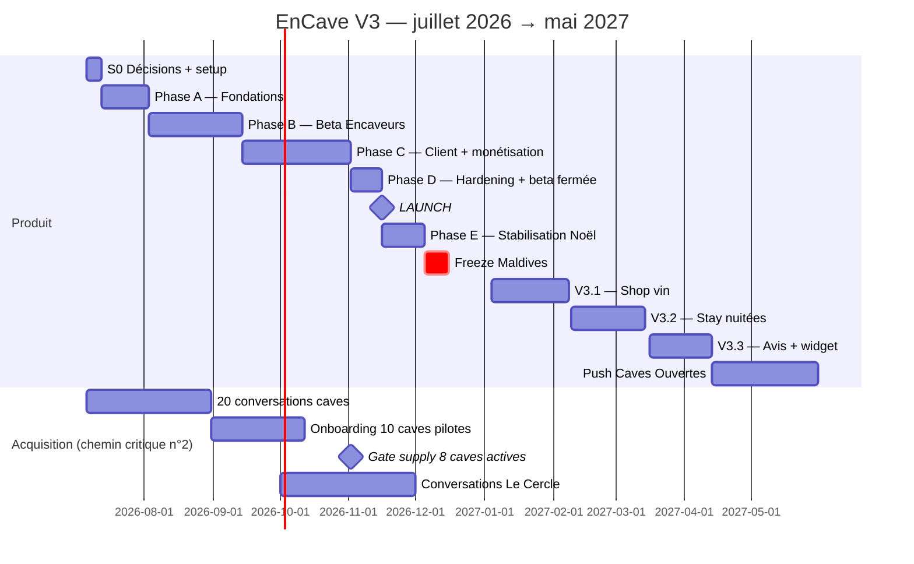

# EnCave V3 — Planning d'exécution

> **Version** : 3.1.0 — 3 juillet 2026 (remplace 3.0.0)
> **Changement clé vs 3.0** : le scope launch intègre Request, bons cadeaux, anti no-show et fiche dégustation → launch décalé du 9 au **16 novembre** (toujours en pleine saison cadeaux). Stay glisse en V3.2 (février, prêt pour la saison), Shop en V3.1 (janvier).
> **Horizon** : 6 juillet 2026 → launch 16 novembre 2026 → Shop février 2027 → Stay mars 2027 → scale Caves Ouvertes mai 2027
>
> ⚠️ **Note d'adaptation (09.07.2026)** : la stack technique mentionnée dans ce doc (Supabase, Drizzle, Trigger.dev, RLS Postgres, monorepo) est **remplacée** par la stack existante du repo (Prisma + Neon + better-auth + Vercel Cron + Upstash) — voir `docs/v3/README.md` et `CLAUDE.md`. Les phases A1-A3 se lisent comme « étendre le schéma/l'infra existants », pas comme un redémarrage à zéro.

---

## 1. Cadre & capacité

- **Équipe** : Sam solo + Claude Code en autonomie encadrée — cycle natif par epic : `/ultraplan` → `/goal` → parallélisation (`/batch`, `/fork`) → `/code-review ultra`.
- **Capacité** : 12 h/sem nominale, pics 15 h. **Budget jusqu'au launch : ~200 h.** La phase C est dense (§7) : les Should sont les fusibles.
- **Cadence** : sprints d'1 semaine, revue dominicale 30 min, `STATUS.md` une ligne/semaine.
- **Contraintes calendrier intégrées** : semaine du 31 août **OFF** (Edinburgh 29.08–03.09) ; 5–15 décembre **FREEZE** (Maldives, alerting actif, zéro deploy) ; fitness dès le 6 juillet (les créneaux dev se calent autour).
- **Règle d'or** : le launch est conditionné par la **supply** (§4), pas par le code.

---

## 2. Vue macro

---

## 3. Détail semaine par semaine

### S0 — 6→12 juil : Décisions & setup _(8 h)_

Trancher les 4 décisions ouvertes du PRD, écrire les 10 ADRs, monorepo + CI/CD + Vercel + Supabase + Trigger.dev + Stripe test + domaines, poser les tokens « Cuir & Taupe » + POC dans `docs/design/` (ENCAVE-V3-DESIGN.md v2). **Exit : pipeline vert, ADRs mergés.**

### Phase A — Fondations : 13 juil → 2 août _(3 sem, ~36 h)_

| Sem | Dates       | Contenu                                                                                                                                  | Exit                           |
| --- | ----------- | ---------------------------------------------------------------------------------------------------------------------------------------- | ------------------------------ |
| A1  | 13–19.07    | Schéma Drizzle **complet** (slot, requests, gift cards, wines, booking_wines ; stay posé mais dormant) + invariants + tests de violation | Toute violation échoue en test |
| A2  | 20–26.07    | RLS 100% + tests rôle×table ; auth (magic link + Google) ; layouts client/producer                                                       | Matrice RLS verte              |
| A3  | 27.07–02.08 | Observabilité (Sentry, Axiom, PostHog EU) ; Resend + premiers templates ; seed réaliste (10 caves, 40 expériences, 60 vins)              | Dashboard santé live           |

### Phase B — Beta Encaveurs : 3 août → 13 sept _(6 sem dont 1 OFF, ~58 h)_

| Sem | Dates       | Contenu                                                                                                  | Exit                                           |
| --- | ----------- | -------------------------------------------------------------------------------------------------------- | ---------------------------------------------- |
| B1  | 03–09.08    | Onboarding cave : profil, photos AVIF, géoloc, politiques (annulation, no-show)                          | Cave créée bout en bout                        |
| B2  | 10–16.08    | Stripe Connect Express : KYC, statuts, webhooks account                                                  | Compte test payout-ready                       |
| B3  | 17–23.08    | Expériences Slot : CRUD + créneaux récurrents + occurrences + blackouts                                  | 12 occurrences générées, page publique preview |
| B4  | 24–28.08    | **Catalogue vins light** (CRUD) + événements collectifs (organisateur + participants) _(semaine courte)_ | US-250 base                                    |
| —   | 31.08–06.09 | **OFF Edinburgh**                                                                                        | —                                              |
| B5  | 07–13.09    | Dashboard réservations + notifications + **fiche dégustation** (cocher les vins)                         | **GATE R1**                                    |

### Phase C — Client + monétisation : 14 sept → 1 nov _(7 sem, ~86 h — la phase dense)_

| Sem | Dates       | Contenu                                                                                        | Exit                      |
| --- | ----------- | ---------------------------------------------------------------------------------------------- | ------------------------- |
| C1  | 14–20.09    | Découverte : liste, filtres, tri proximité, ISR + tags                                         | LCP < 1.5 s sur seed      |
| C2  | 21–27.09    | Carte Mapbox lazy + fiche expérience + sélecteur créneaux temps réel                           | Lecture complète          |
| C3  | 28.09–04.10 | **Booking core** : holds Redis, décrément atomique, Checkout TWINT, webhooks idempotents       | k6 : zéro survente        |
| C4  | 05–11.10    | Billets QR/PDF/wallet + emails transactionnels + **email J+2 boucle vin**                      | US-201 + US-230           |
| C5  | 12–18.10    | Annulation/remboursement + check-in QR PWA + **anti no-show** (SetupIntent, prélèvement 1 tap) | US-202/301/220            |
| C6  | 19–25.10    | **Bons cadeaux** : achat, PDF personnalisé, envoi programmé, rédemption au checkout (ledger)   | US-210, k6 gift codes     |
| C7  | 26.10–01.11 | **Request** : formulaire, offres, liens de paiement, relances + SEO/OG + compte client minimal | US-240 · **GATE R2 code** |

### Phase D — Hardening & beta fermée : 2 → 15 nov _(2 sem, ~24 h)_

- D1 (02–08.11) : k6 complet (slot + gift), audit RLS/CSP, checklist nLPD, runbooks, Lighthouse ≥ 95, tests des 6 parcours Playwright.
- D2 (09–15.11) : **beta fermée** — caves fondatrices publient en réel, ~20 réservations tests en vrais paiements (remboursées), 2-3 bons cadeaux tests, 1 request réelle, corrections.

### 🚀 LAUNCH : lundi 16 novembre 2026

Soft launch : réseaux des caves + SEO local + push bons cadeaux « offrez une cave pour Noël ». **19 jours de stabilisation avant le freeze.**

### Phase E — Stabilisation Noël : 16 nov → 4 déc _(~28 h)_

Monitoring quotidien, fixes, campagne bons cadeaux (le produit star de la saison), collecte des demandes Shop auprès des caves, préparation freeze (runbook, alerting téléphone, flags).

### Freeze : 5–15 déc (Maldives) → reprise douce jusqu'au 31.12 (support + ventes cadeaux de dernière minute, zéro feature).

### V3.1 — Shop vin : 4 janv → 7 fév 2027 _(5 sem, ~55 h)_

Boutique par cave (upgrade du catalogue light), panier mono-cave, checkout, retrait/expédition par la cave, 18+ & TVA, bons cadeaux utilisables, **boucle J+2 → achat direct**. Gate : 5 caves avec ≥ 10 vins en ligne.

### V3.2 — Stay : 9 fév → 13 mars 2027 _(5 sem, ~50 h)_

Activation du schéma dormant : inventaire par nuit, calendrier, booking séjour tout-ou-rien (k6 dédié), packages dégustation. **Prêt pour la saison printemps.** Gate : 3 caves avec nuitées réelles publiées.

### V3.3 — Confiance : 16 mars → 12 avril 2027

Avis vérifiés (billets scannés uniquement) + widget iframe si ≥ 3 caves demandeuses + split multi-caves des événements collectifs si un événement pilote l'exige.

### Scale : 13 avril → mai 2027

Contenu SEO, partenariats, préparation et **push Caves Ouvertes 2027** — objectif 30 caves, 500 billets sur l'événement. Décision Le Cercle (go/no-go) sur la base des conversations d'automne.

---

## 4. Workstream Acquisition — chemin critique n°2 (~3 h/sem, non négociable)

| Période          | Objectif                                                               | Actions                                                                                                                      |
| ---------------- | ---------------------------------------------------------------------- | ---------------------------------------------------------------------------------------------------------------------------- |
| 6 juil – 30 août | **20 conversations, 10 intentions**                                    | Caves connues d'abord ; pitch « on vous amène des clients + zéro admin + Booking sans les 18% » ; Fondateurs 0% comme levier |
| 31 août – 11 oct | **10 caves onboardées**                                                | Sessions assistées 30 min, Sam présent ; recueillir les politiques no-show et annulation réelles                             |
| 12 oct – 1 nov   | **8 caves actives, ≥ 24 expériences, dispos réelles nov-déc**          | **GATE SUPPLY** — sinon launch décalé au 23.11 (dernier créneau : 30.11)                                                     |
| Oct – nov        | **Le Cercle : 2-3 conversations domaines haut de gamme + 1 sommelier** | Coût zéro, signal go/no-go pour 2027 ; n'engage aucun dev                                                                    |
| Nov – jan        | 15 caves ; recueil demandes Shop et Stay                               | Priorise V3.1/V3.2 sur du réel                                                                                               |
| Fév – mai 2027   | 30 caves avant Caves Ouvertes                                          | Effet réseau Sierre/Sion/Martigny/Fully                                                                                      |

---

## 5. Gates — critères mesurables

| Gate          | Date     | Critères (tous requis)                                                                                 | Si raté                                     |
| ------------- | -------- | ------------------------------------------------------------------------------------------------------ | ------------------------------------------- |
| **G-R0**      | 02.08    | CI verte, invariants + RLS testés, observabilité live                                                  | Décaler B ; ne jamais sauter les invariants |
| **G-R1**      | 13.09    | 3 caves pilotes publient seules une expérience < 30 min ; fiche dégustation utilisée 1× en réel        | +1 sem UX onboarding avant C                |
| **G-R2 code** | 01.11    | k6 zéro survente + zéro double-rédemption gift ; Lighthouse ≥ 95 ; nLPD complet ; 6 parcours e2e verts | D1 prolongé, launch 23.11                   |
| **G-Supply**  | 02.11    | ≥ 8 caves actives, ≥ 24 expériences, dispos réelles nov-déc                                            | **Launch décalé** — pas de marketplace vide |
| **G-Launch**  | 16.11    | G-R2 + G-Supply + runbooks + astreinte définie                                                         | Dernier créneau avant freeze : 30.11        |
| **G-Shop**    | 07.02.27 | 5 caves ≥ 10 vins, 1ʳᵉ commande réelle livrée                                                          | Signal, ajuster V3.1                        |
| **G-Stay**    | 13.03.27 | 3 caves nuitées publiées, k6 stay vert                                                                 | Prêt saison ou décalage 2 sem max           |

---

## 6. Chemin critique & dépendances

`Schéma DB (A1) → Stripe Connect (B2) → Booking core (C3) → Billets (C4) → Gift cards (C6) → Beta (D2) → Launch`

- **C3 reste la semaine la plus risquée** (concurrence + argent). Placée début octobre : si elle déborde, elle mange C7-Should puis D1, pas le launch.
- **C6 (bons cadeaux) est sur le chemin critique commercial** : sans elle, on rate la saison Noël — c'est LA feature qui justifie le launch de novembre.
- Request (C7) est le premier fusible : dégradable en « formulaire → email à la cave » (offre et paiement manuels) si la vélocité l'exige, upgrade en décembre.
- Mapbox, SEO, compte client : hors chemin critique, dégradables sans décaler.

## 7. Risques planning & buffers

| Risque                                                | Buffer                                                                                                                                                                                      |
| ----------------------------------------------------- | ------------------------------------------------------------------------------------------------------------------------------------------------------------------------------------------- |
| Phase C dense (86 h / 7 sem = 12.3 h/sem, zéro marge) | Fusibles ordonnés : 1. Request simplifié 2. SEO/OG 3. compte client → jamais toucher booking core ni gift cards                                                                             |
| C3 ou C6 déborde                                      | D1 absorbe 1 semaine ; launch glissable au 23.11 sans casser la saison                                                                                                                      |
| Supply < 8 caves au 2.11                              | Launch 23 ou 30.11 ; en dessous de 6 caves → launch janvier assumé, la campagne cadeaux se fait quand même via les caves signées (pages publiques + bons cadeaux fonctionnent avec 6 caves) |
| Énergie (mariage récent, fitness, day job)            | 12 h/sem assumées basses ; semaine < 6 h = re-priorisation dominicale, pas de rattrapage nocturne                                                                                           |
| Litige no-show ou gift card en prod                   | Feature flags : désactivables en 1 min sans deploy                                                                                                                                          |

## 8. Rituels & Definition of Done

- **Dimanche 30 min** : revue, replanif, `STATUS.md`.
- **Par epic — cycle Claude Code natif** :
  1. `/ultraplan <epic + référence aux docs>` : plan rédigé dans le cloud, review navigateur (commentaires inline), teleport au terminal.
  2. `/goal "<DoD mesurable>"` : exécution autonome jusqu'à condition remplie (tests verts, k6, lint/typecheck, budgets perf).
  3. `/batch` ou `/fork` pour les unités indépendantes (emails, seed, PDF) en worktrees parallèles pendant que le core avance.
  4. Avant merge : `/code-review high` par défaut ; les 3 runs gratuits de `/code-review ultra` sont réservés aux epics d'argent (C3 booking, C6 gift cards, pré-launch) ; `/security-review` obligatoire avant le 16.11.
- **DoD release** : e2e verts, budgets perf tenus, invariants testés, doc à jour, feature-flaggé si financier, **démo Loom envoyée aux caves pilotes** — ça sert le produit et l'acquisition.
